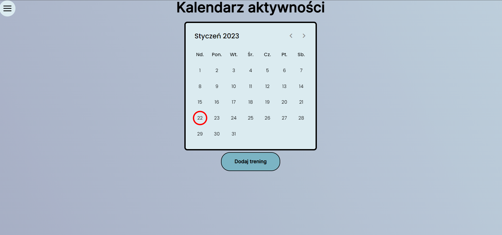
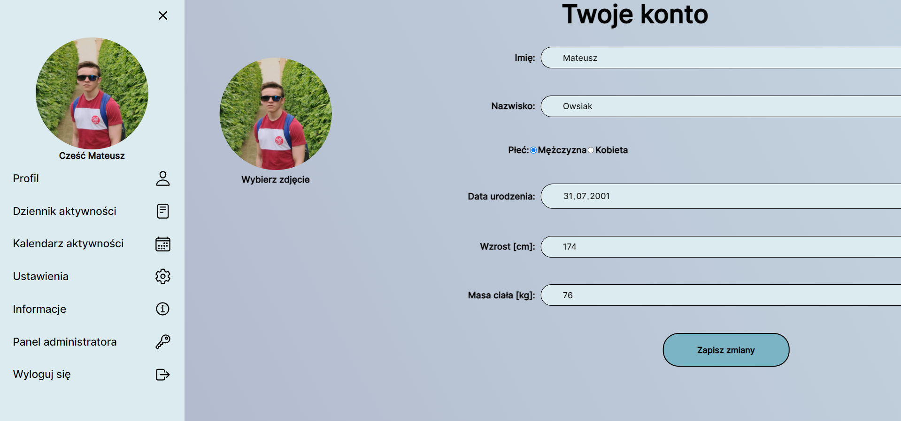
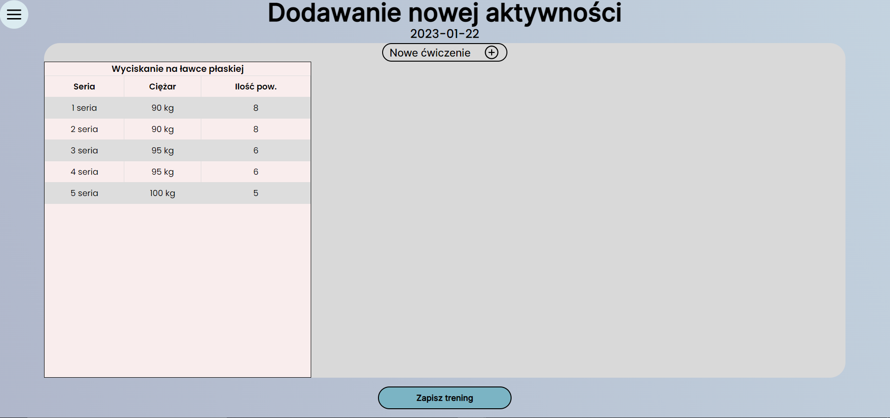
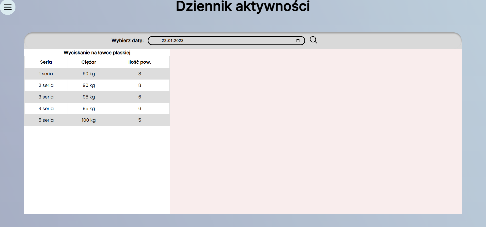
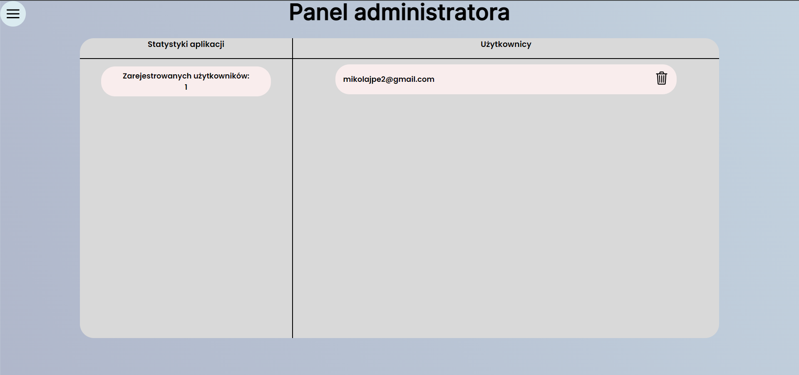

# FitG
## Table of Contents
* [General Info](#general-information)
* [Technologies Used](#technologies-used)
* [Features](#features)
* [Screenshots](#screenshots)
* [Usage](#usage)
* [Project Status](#project-status)
* [Contact](#contact)

## General Information
FitG is an application made for people who want to keep up with their training activities. You can store your training days by simply adding the exercises to the certain day. The app comes with help when you want to see if you are making progress.

## Technologies Used
- HTML5
- CSS3
- PostgreSQL
- Docker 
- PHP 8.0
- JavaScript

## Features
- The user can add training to a certain day
- The user can check history of training
- The user can set his parameters and update them throughout using the app
- The user can change password
- The user can set his profile picture
- The admin can see the statistics of the app and delete registered users

## Screenshots

## Usage
- Register with your email 
- Login to your account
- Set your personal data and profile picture
- If you trained in certain day, add the training in the app
- If you want to take a look on a certain training day, simply input the date

## Project Status
Project is: _in progress_ 

## Contact
Created by Mateusz Owsiak - feel free to contact me!
